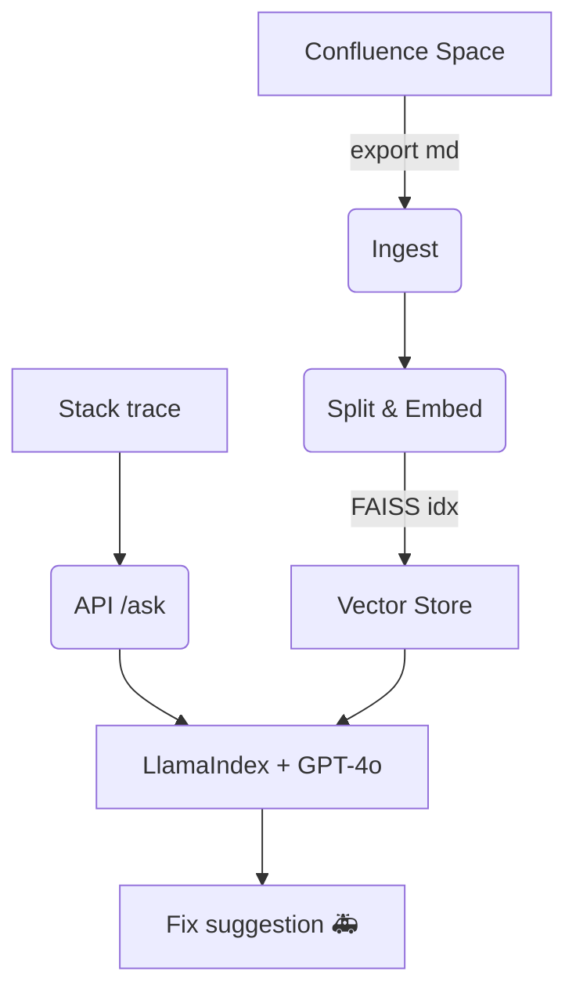

# 🚀 WildFly AI Assist

[](../../-/pipelines) 
[](LICENSE) 
[](https://fastapi.tiangolo.com/) 
[](https://openai.com)

**WildFly AI Assist** is a lightweight *Retrieval-Augmented Generation* (RAG) micro-service that turns raw **WildFly** stack traces into **actionable fixes** by leveraging your internal **Confluence** documentation.

> ⏱️ Indexes ~1 000 Confluence pages in under 2 minutes on a typical laptop.

---

## 📑 Table of Contents
- [Key Features](#-key-features)
- [Technology Stack](#-technology-stack)
- [Quick Start](#-quick-start)
- [Docker & CI/CD](#-docker--cicd)
- [Architecture](#-architecture)
- [Modularity & Reusability](#-modularity--reusability)
- [Interview Value](#-interview-value)
- [Contributing](#-contributing)
- [License](#-license)

---

## ✨ Key Features
| | |
|---|---|
| ⚡ **Instant troubleshooting** | Radically reduces incident resolution time. |
| 🔒 **Fully offline-capable** | Sensitive logs never leave your network. |
| 📚 **Leverages existing docs** | Reuses your Confluence knowledge base. |
| 🏎️ **Fast PoC** | < 500 lines of code—perfect interview demo. |

---

## 🧰 Technology Stack
| Layer | Tech |
|---|---|
| API & runtime | **Python 3.12**, FastAPI, Poetry |
| AI pipeline | **GPT-4o**, LlamaIndex (RAG), **FAISS** |
| Knowledge source | Confluence Cloud/Server REST API |
| DevOps | Docker, GitHub Actions |

---

## ⚡ Quick Start

```bash
# 1 – Install dependencies
curl -sSL https://install.python-poetry.org | python3 -
git clone https://github.com/attilagrynaeus/wildfly-ai-assist.git
cd wildfly-ai-assist
poetry install
cp .env.example .env          # ← add your tokens

# 2 – Fetch Confluence pages and build the index
poetry run python -m app.ingest
poetry run python -m app.embed

# 3 – Launch the API
poetry run uvicorn app.api:app --reload
````

```bash
curl -X POST http://localhost:8000/ask \
     -H "Content-Type: application/json" \
     -d '{"log":"WFLYCTL0180: ... DefaultDataSource is missing"}'
```

---

## 🐳 Docker & CI/CD

```bash
# Build
docker build -t wildfly-ai-assist .

# Run
docker run -p 8000:8000 --env-file .env wildfly-ai-assist
```

The sample `ci.yml` workflow automatically:

1. Runs linting & tests
2. Builds and pushes a multi-arch Docker image
3. (Optionally) creates a release

---

## 🏗️ Architecture



---

## ♻️ Modularity & Reusability

* **Plug-and-play knowledge base** — swap the Markdown input and instantly get a Spring Boot-, Kubernetes-, or any other domain assistant.
* Clean modules (`ingest | embed | agent | api`) make porting to new domains trivial.


---

## 🤝 Contributing

1. Fork → create a feature branch → open a Merge Request.
2. Run `pytest -q` before each commit.
3. Ideas and improvements are welcome! 🎉

---

## 📝 License

MIT © 2025 Your Name

---

> *“Good software is like a good joke — it works on multiple levels.”* 😉

```
